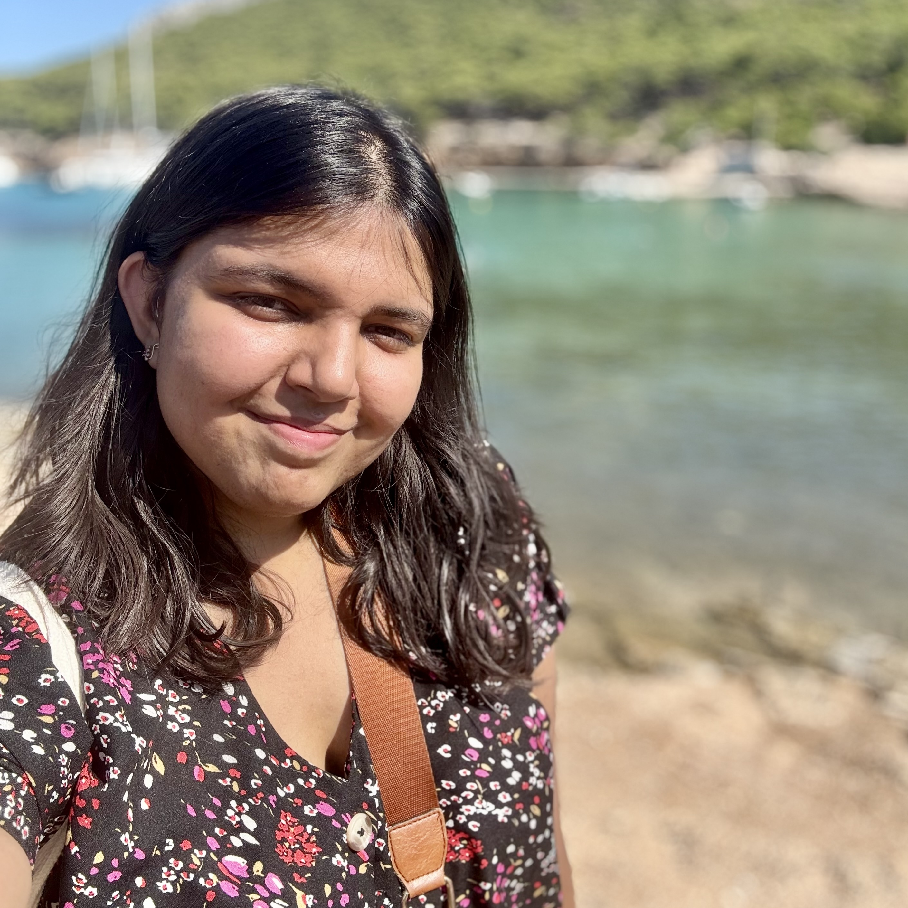

Hi! I'm **Mahika Phutane**, a PhD candidate at Cornell.

 

I'm advised by [Prof. Aditya Vashistha](https://www.adityavashistha.com/){:target="_blank"}, and I study how artificial intelligence (AI) serves, represents, and supports people with disabilities.
 
 
My research investigates **disability bias in AI systems by centering the experiences of people with disabilities to evaluate and shape AI safety**. Using mixed methods inquiry, I focus on high-stakes domains like online harm and algorithmic hiring, spaces where AI may deepen the very exclusions it is meant to solve.
 
 
Navigating away from [W.E.I.R.D](https://doi.org/10.1145/3593013.3593985){:target="_blank"} framings of harm, I also study disability bias in the Global South, where 80% of the world's disabled populations reside ([UN](https://www.un.org/development/desa/disabilities/resources/factsheet-on-persons-with-disabilities.html){:target="_blank"}). I examine how global inequities are reproduced in AI systems, 
presenting a deliberate effort to weave cross-cultural framings of disability into my evaluations of global and regional AI models.
 
 
More broadly, my research lies at the intersections of Human-Computer Interaction, Accessibility, Human-Centered AI, and AI Safety.
 
 
My research is published in top venues such as ACM CHI, ASSETS, FAccT, and AAAI/ACM AIES, 
and spans collaborations across industry (Microsoft Research), and government (NYC Mayor’s Office of PwD).
My work has been generously supported by the [Dennis Washington Foundation](https://www.dpwfoundation.org/scholarships/dennis-washington-leadership-graduate-scholarship/), [Siegel Public Interest Tech Impact Fellowship](https://www.pi.tech.cornell.edu/pitech-phd-impact-fellowship), and DLI Doctoral Fellowship.
<!-- As assistive technologies begin to incorporate and rely on emerging AI systems, there is a concern that **these technologies may perpetuate disability bias and promote ableist behaviors** and sentiments.
I use a mixture of quantitative, qualitative, and design research methods to identify these growing concerns. 
I work closely with marginalized populations and advocate for equitable disability representation in these emerging AI systems. 
My research spans the fields of Human-Computer Interaction, Accessibility, and AI Fairness. -->
 

{::nomarkdown}

{:/}

News Highlights

**July 2025**:&ensp;Paper on [Cross-Cultural Ableism in AI](https://arxiv.org/abs/2507.16130) accepted at AIES '25!

**Jun 2025**: &ensp;Presented Ableism in LLMs [Paper](https://dl.acm.org/doi/10.1145/3715275.3732128) at FAccT '25 in Athens, Greece!

**Jun 2024**: &ensp;Started an internship at Microsoft Research India in Bengaluru!

**Oct 2023**: &ensp;Presented Conversational Screen Reader [Paper](https://dl.acm.org/doi/10.1145/3597638.3608404) at ASSETS '23 in NYC!

**Sep 2023**: &ensp;Awarded the DLI Doctoral [Fellowship](https://www.dli.tech.cornell.edu/people)!

**May 2023**: &ensp;Awarded the [PiTech Fellowship](https://www.pi.tech.cornell.edu/spotlight/siegel-pitech-impact-fellowship-in-its-third-year) to work with the NYC MOPD! 

**Oct 2022**: &ensp;Presented Tactile Materials [Paper](https://dl.acm.org/doi/abs/10.1145/3508364) at ASSETS '22 in Athens, Greece!

**May 2021**: &ensp;[Paper](https://dl.acm.org/doi/10.1145/3411763.3451574) accepted at CHI Interactivity!

**Jan 2021**: &ensp;Presented [Maestro](https://magenta.tensorflow.org/maestro-vocal-coach), an AI Vocal Coach, at Google Magenta

**May 2020:**&ensp;Graduated from UToronto with a B.Sc in Computer Science and CCIT! 🎓

**Feb 2020:**&ensp;Appeared in the Wall Street Journal for winning [Dennis Washington Fellowship](https://www.utm.utoronto.ca/main-news/scholarship-gives-former-utm-student-push-strive-something-bigger)!

<!-- Thank you for being here, and I welcome you to read further where I delve more into:
  - [my past](about/), my prior research work and undergrad experience
  - [my current happenings](work/), my current research endeavours
  - [my future](/), brainstormed ideas for upcoming projects (TODO) -->

  <!-- You would normally put your [full name](about/) here and say something *smart* about yourself. -->

  <!-- This could also be the good place to say were you are coming from, what you [do for a living](work/) and maybe what you are [interested in](projects/). You might also be [writing](articles/) about stuff.  -->

  <!-- But after all this is your site and I'm just a **placeholder text** so what would i know about some *home page content*. -->
